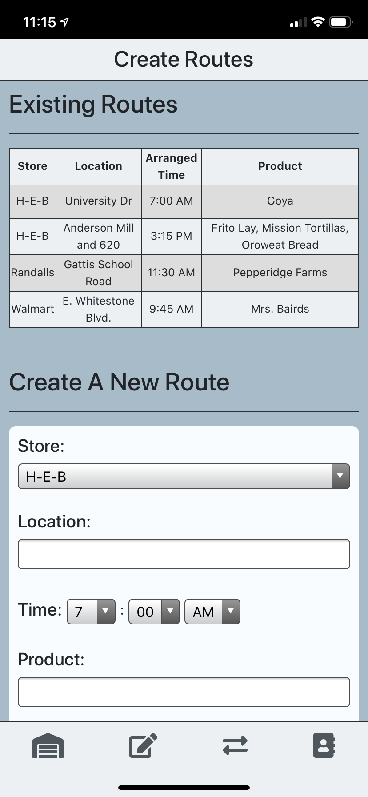

# [Quick Merch](https://quickmerch.app/) &middot; Created By Israel Medina

Quick Merch is a Progressive Web App (PWA) that allows admins to assign routes to merchandisers and merchandisers to see their routes for the day. 

[Learn more about Progressive Web Apps](https://web.dev/pwa-checklist/).

    

## Installation

Quick Merch can be downloaded on both desktop and mobile! Visit the [website](https://quickmerch.app) on **_Google Chrome_** for Android or dekstop, or **_Safari_** for iPhone/iPad, and follow the on-screen instructions.  

Once you get the site you can sign up or login in as an existing user. Admins will have the option to sign in as admin if they have the appropriate credentials. 

---

## Images

### Merchandisers Views 

 

--- 

### Admin Views

 

---

## Technologies

Quick Merch is a Full Stack Progressive Web App. 

### Back End

* Express server to handle the api/html routes as well as connecting to our database. 

* MySQL database that holds our users as well as all the merchandising routes.

* [Sequelize ORM](https://sequelize.org/v5/) to handle associations and easily perform CRUD actions.

* [Passport.js](http://www.passportjs.org/) to handle sessions and authenticate users with **Node.js**

* Bcrypt.js to encrypt user passwords and allow for extra security.

### Front End

* Bootstrap to help with popups such as modal's and the navbar

* HTML5 in conjuction with CSS3 to make the site mobile and desktop responsive as well as creating a polished UI. 

### PWA

* Quick Merch has been made a Progressive Web App through the use of a **service worker** and **webmanifest** allowing the website to cache necessary files. 

### Deployment 

Quick Merch has been deployed on Heroku with the domain registered under Google Domains. Heroku has also provided an SSL Certificate allowing for even more security when accessing the site. 

## Contributors

* Israel Medina [Github](https://github.com/medinaisrael-17) | [LinkedIn](https://www.linkedin.com/in/israel-medina-271344180/) | [Portfolio](https://israelmedina.dev)